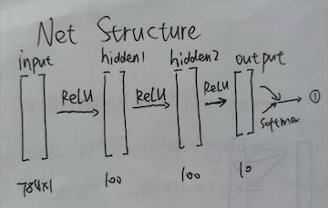

# MNIST with Neural Network

## 1.Net Structure
The net is 2 layers shallow net shown as.  
Size of hidden layer might differ due to fine-tuning  

## 2. Result
Accuracy is 97% with or without momentum

## 3. Speed 
On my 14' mac it takes **3m19s** to run
On Google Colab Server it takes **50s**
Colab GPU accelarted 